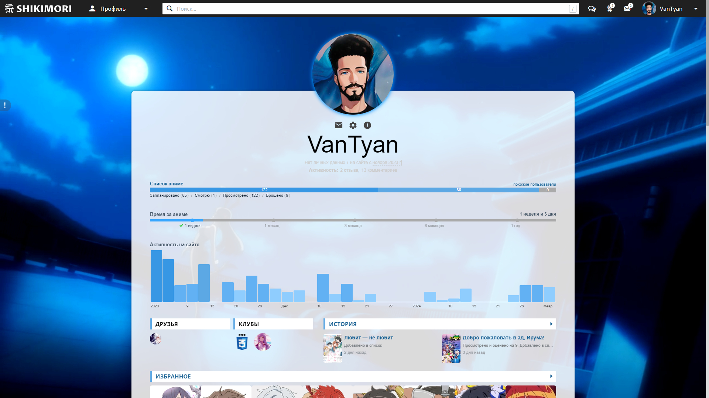

# Shiki-moonlight
Светлая тема для сайта [shikimori](https://shikimori.one/).

Некоторые идеи были позаимствованы у @grin3671 и @EngiNier

## Скриншоты
<details>
<summary>Показать</summary>





 
</details>

## Особенности
- Возможность менять надписи к оценкам
- Пасхалка для искусствоведов
- Адаптировано под мобильную версию

## Установка
1. Заходим в настройки shikimori
2. Переходим в раздел "Профиль"
3. Ставим галочку "Улучшить качество картинок избранного в профиле"
4. Меняем "Количество избранного в профиле" по желанию
5. Нажимаем сохранить
6. Переходим в раздел "Внешний вид сайта"
7. Вставляем в окошко "Стили сайта" следующий код:
```css
@media (min-width: 24px) {
	/* Основная тема */
	@import url("https://raw.githubusercontent.com/vankad24/shiki-moonlight/master/styles/style.css");
	:root{
		--background-url: url("ссылка на фоновую картинку");

		--favourites-shadow: #ffffff;
		
		--avatar-shadow: #0195ff;
		--avatar-size: 220px;

		--avatar-url: url("ссылка на аватар");
		/* если не указывать, будет ваш аватар shikimori */
	}

	/* Надписи к оценкам */
	@import url("https://raw.githubusercontent.com/vankad24/shiki-moonlight/master/styles/custom_score_notes.css");
	:root{
		/* Это надписи по умолчанию. Вы можете именить их на другие */
		--score-10-text: "Эпик вин!";
		--score-9-text: "Великолепно";
		--score-8-text: "Отлично";
		--score-7-text: "Хорошо";
		--score-6-text: "Нормально";
		--score-5-text: "Более менее";
		--score-4-text: "Плохо";
		--score-3-text: "Очень плохо";
		--score-2-text: "Ужасно";
		--score-1-text: "Хуже некуда";
	}
}
```
8. Вставляем ссылки на картинки и редактируем надписи в коде выше
9. Нажимаем сохранить
10. Радуемся жизни!

## Дополнительно
Правила нужно оборачивать в `@media (min-width: 24px)`, иначе на телефонах css переменные не будут работать (приколы shikimori).

Пасхалка для искусствоведов - это гифка, которая появляется при наведении на достижение "Искусствовед".
Чтобы её включить, добавьте следующие переменные:
```css
:root{
	--image-gif: url("ссылка");
	--display-gif: block;
}
```

Если вы используете другую тему и хотите лишь изменить надписи к оценкам, используйте следующий код:
```css
@media (min-width: 24px) {
	@import url("https://raw.githubusercontent.com/vankad24/shiki-moonlight/master/styles/custom_score_notes.css");
	:root{
		/* Это надписи по умолчанию. Вы можете именить их на другие */
		--score-10-text: "Эпик вин!";
		--score-9-text: "Великолепно";
		--score-8-text: "Отлично";
		--score-7-text: "Хорошо";
		--score-6-text: "Нормально";
		--score-5-text: "Более менее";
		--score-4-text: "Плохо";
		--score-3-text: "Очень плохо";
		--score-2-text: "Ужасно";
		--score-1-text: "Хуже некуда";
	}
}
```

<hr>

Об ошибках можете писать [сюда](https://github.com/vankad24/shiki-moonlight/issues/new).